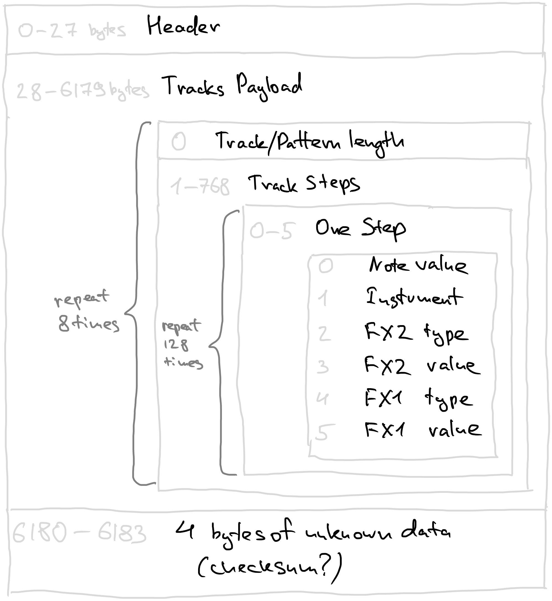

# Pattern Files Reverse Engineering

File extension: `*.mtp`

Location: `polyend_project_folder/patterns`

Number of files corresponds to number of patterns the project contains. There seems to be at least one even in newly initialized projects.

Reference test project files created on firmware v1.5.0.

# Pattern File Structure

